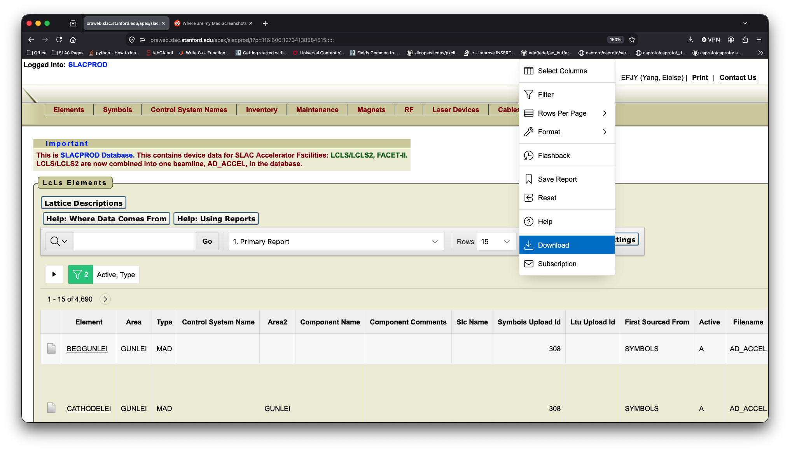

# Installation

## Clone Databases With Git
The slac-db repo uses git lfs to store its sqlite databases. You can find install isntructions for git lfs here:
https://git-lfs.com/

## Install Without DBs
A simple git clone without lfs will grab the DB code without the sqlite databases. You will have to generate the databases yourself.

# Create Databases
We have two databases at LCLS, the directory service and the Oracle database, called lcls_elements. Both are maintained by IOC and hardware engineers. We create local copies in slac-db for our own convenience. The slac-db repo combines these databases with additional metadata to create a device db.

Our three databases are:
```
directory_service.sqlite3
lcls_elements.sqlite3
device.sqlite3
```

## directory_service db
The directory service db is generated by querying the directory service for all known PVs. It is equivalent to:
``` python
def get_pvs():
    import meme.names
    return meme.names.list_pvs("%")
```
You need access to meme in order to generate this DB. To genearate the DB, run the following on mcclogin.
``` python
import slac_db.create
slac_db.create.directory_service_db()
```

## lcls_elements db
The lcls_elements db is sourced from a CSV file, which we pull from Oracle. This is not a long term solution to pulling from Oracle, but it's what we've been doing in development.

To pull this CSV file yourself, navigate to this website while logged into your SLAC VPN. https://oraweb.slac.stanford.edu/apex/slacprod/f?p=116:600:12734138584515

Click actions, then select "download" from the drop menu.



By default, this file is stored in the `slac_db/package_data` directory.

To generate the lcls_elements db, run the following script:

``` python
import slac_db.create
slac_db.create.oracle_db() #optionally include csv_source='path/to/csv'
```

## device db
Once you've created the directory service and Oracle sqlite databases, you can generate the device db. This can be done anywhere.
``` python
import slac_db.create
slac_db.create.device_db()
```

## Additional Metadata
You might want to include additional metadata for your devices. We only have one way of doing that for the time being. The file `slac_db/package_data/wire_metadata.yaml` indexes additonal metadata by device name. The file name is legacy because the Wire Scanner developer was the main user of this file.

For example:
``` yaml
DEVICE_0:
    device_type: 'simple'
```
stores a field called 'device_type' with value 'simple' for 'DEVICE_0' in the `device_meta_string` table.

Another example:
``` yaml
DEVICE_0:
    friends:
      - DEVICE_1
      - DEVICE_2
```
creates a field called 'friends'. It generates its value by dumping the YAML object (in this case a list) as a string in `device_meta_string`. The idea is to use the dumped to recreate the object with `yaml.safe_load` when needed. This functionality isn't fully implemented yet.
